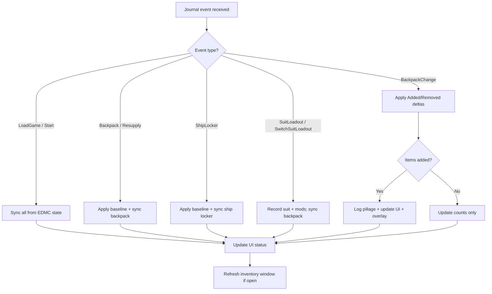

# ED-PLG Design Specification

**Version:** 0.7.0  
**Author:** CMDR Bocheaux  
**Last updated:** 2026-07-13

## 1. Purpose

ED-PLG (Elite Dangerous Pillage Ledger & Gear-tracker) is a lightweight
[Elite Dangerous Market Connector](https://github.com/EDCD/EDMarketConnector)
plugin for *Elite Dangerous: Odyssey* commanders who raid settlements, loot
containers, and download data while on foot.

The plugin answers two questions:

> *What did I just pick up, and how much of it do I now hold across my backpack,
> ship locker, and carrier locker?*

> *Do I have room — and enough already — to make this next pickup worth the slot?*

The first is answered passively, at the moment of looting (log line, EDMC panel,
and in-game overlay). The second is answered on demand, in the inventory window.

## 2. Scope

### In scope

- Odyssey microresources used for **suit and weapon upgrades**:
  - **Components** (e.g. Weapon Component, Carbon Fibre Plating) — *Assets* in-game
  - **Items** (e.g. Suit Schematic, Weapon Schematic) — *Goods* in-game
  - **Data** (e.g. Manufacturing Instructions, Settlement Plans)
- Inventory held in the **suit backpack** (on-foot), **ship locker** (stored), and
  **fleet carrier locker** (via CAPI).
- Backpack **capacity** for the currently worn suit.
- Real-time feedback via EDMC log output, a UI panel, and an optional in-game overlay.

### Out of scope

- Ship engineering materials (`Materials` event: Raw, Manufactured, Encoded).
- **Commodity cargo.** Cargo tonnage (ship cargo racks, the 25,000 t carrier hold,
  SRV canisters) is a separate game system from the microresource locker. ED-PLG
  tracks microresources only; no tonnage figure appears anywhere in the plugin.
- Combat logging, bounty tracking, or market/trading data.
- Network services, cloud sync, or external databases.
- Consumables (tracked internally for completeness but not emphasised in output).

## 3. User Experience

### 3.1 Primary interaction

When the commander loots while on foot, the game writes a `BackpackChange`
journal event. ED-PLG detects additions and emits:

```
[Manufacturing Instructions] pillaged! New Inventory Total: 12
```

The total **X** reflects combined counts in the suit backpack and ship locker
for that resource.

### 3.2 UI panel

A single row on the EDMC main window displays:

| Element | Content |
|---------|---------|
| Label | `ED-PLG:` |
| Status | Current sync state (e.g. "Inventory synced", "+2 item(s) pillaged") |
| Button | **Inventory** — opens the inventory window (§3.5) |
| Last event | Most recent pillage message (green text) |

The UI updates only from the main EDMC thread via `journal_entry()` callbacks.
No background threads touch Tkinter widgets.

### 3.3 Log output

All pillage events are written at `INFO` level through Python's `logging` module.
Logs appear in `%TEMP%\EDMarketConnector.log` alongside core EDMC output.

### 3.4 In-game overlay

When an overlay plugin is present, each pickup is also drawn in-game:

```
+1  Manufacturing Instructions: 13
+2  Circuit Board: 5
```

| Property | Behaviour |
|----------|-----------|
| Provider | EDMCModernOverlay, via its legacy `edmcoverlay` compatibility layer |
| Absent provider | Silently skipped; the plugin is fully functional without it |
| Stack depth | 5 lines, newest first |
| Lifetime | 8 seconds per line |
| Repeat pickups | Update the item's existing line and float it to the top |
| Message IDs | `edplg-pillage-N`, sharing the `edplg-` prefix so the stack can be repositioned as a group from ModernOverlay's controller |
| User control | Toggle in **File → Settings → ED-PLG** |

The overlay is a *notification*, not a display: it answers "what did I just get",
and disappears. Standing information belongs in the inventory window.

### 3.5 Inventory window

Opened from the **Inventory** button; a non-modal `Toplevel` that can stay open
during play and refreshes live on every inventory-changing journal event.

One tab per storage location — **Backpack**, **Ship Locker**, **Carrier Locker** —
each showing:

1. A heading naming the worn suit and its Extra Backpack Capacity status.
2. A total and capacity bar per category (Assets, Goods, Data).
3. Every resource held, with its count, sorted by category then descending count.

This is the "should I loot this?" view: the capacity bar shows how close the
backpack is to full, and the item list shows how much of a resource is already
banked elsewhere.

Where a capacity is unknown (see §7), the total is shown without a limit rather
than against a guessed figure.

Window geometry is persisted between sessions in EDMC's config.

## 4. Functional Requirements

| ID | Requirement |
|----|-------------|
| FR-01 | Establish inventory baseline on game load (`LoadGame`, `Start`). |
| FR-02 | Refresh backpack baseline on `Backpack`, `Resupply`, and `SuitLoadout`. |
| FR-03 | Refresh ship locker baseline on `ShipLocker`. |
| FR-04 | Process `BackpackChange` `Added` entries and log pillage messages. |
| FR-05 | Process `BackpackChange` `Removed` entries silently (update counts only). |
| FR-06 | Map internal journal IDs to human-readable names. |
| FR-07 | Prefer `Name_Localised` from journal events when available. |
| FR-08 | Do not block the EDMC main thread during event handling. |
| FR-09 | Track the worn suit (`SuitLoadout`, `SwitchSuitLoadout`) and derive backpack capacity from it. |
| FR-10 | Send an overlay notification per pickup when an overlay provider is installed, and degrade silently when it is not. |
| FR-11 | Present backpack, ship locker, and carrier locker contents on demand, with per-category totals against capacity. |
| FR-12 | Never display a guessed capacity; show a bare count when the figure is unknown. |
| FR-13 | Warn (log + overlay) when a ship locker category crosses 90% of capacity, independently per category. |

## 5. Data Model

Inventory is organised as three stores, each with three categories:

```
InventoryTracker
├── backpack
│   ├── Component  → { canonical_name: count, ... }
│   ├── Item       → { canonical_name: count, ... }
│   └── Data       → { canonical_name: count, ... }
├── ship_locker
│   ├── Component
│   ├── Item
│   └── Data
└── fleet_carrier_locker      (per-commander, cached; sourced from CAPI)
    ├── Component
    ├── Item
    └── Data

SuitState
├── suit_key   → explorationsuit | tacticalsuit | utilitysuit | flightsuit
├── grade      → 1-5
└── mods       → ("suit_backpackcapacity", ...)
```

Internal names are canonicalised (lowercase, no spaces) to match EDMC's
`monitor.canonicalise()` behaviour.

Carrier locker data is cached per commander so that switching accounts does not
bleed counts between CMDRs.

## 6. Event Flow



## 7. Suit Backpack Capacity

**The journal does not report backpack capacity.** It reports what is *in* the
backpack, never how much the backpack holds. Capacity must therefore be supplied
by the plugin.

It is derived from two journal fields on `SuitLoadout` / `SwitchSuitLoadout`:

| Field | Example | Use |
|-------|---------|-----|
| `SuitName` | `explorationsuit_class3` | Suit type (and grade, which does not affect capacity) |
| `SuitMods` | `["suit_backpackcapacity"]` | Presence of *Extra Backpack Capacity* |

These feed a hardcoded table in `suit.py` (see
[Technical Specification §7](./tech-spec.md#7-suit-backpack-capacity) for the values).

Design rules:

- **The plugin never guesses.** A suit with no table entry (currently the
  Flight Suit) shows counts with no capacity, rather than a plausible-looking
  wrong number. A wrong capacity is worse than no capacity: the entire point
  of the window is deciding whether to loot, and a bad figure produces a bad
  decision. The one exception is an explicit value the commander types in
  themselves (see below) — that's ground truth the commander observed
  in-game, not a plugin-generated guess.
- **Store the observed value, not the modifier.** Base and modded capacities are
  listed explicitly rather than derived by doubling, because the multiplier is not
  uniform across categories.
- Capacity figures are game data, not journal data, and may drift when Frontier
  rebalances suits. They live in one table so they can be corrected in one place.

The hardcoded table only tracks whether *Extra Backpack Capacity* is fitted,
not its engineering grade — so it can't be exactly right for every commander,
and has no entry at all for the Flight Suit. To cover both cases, the
Settings tab lets a commander enter their own observed capacity per
category, tracked per owned suit loadout (keyed by the journal's
`LoadoutID`, auto-discovered as loadouts are worn — see `suit.py`'s
`known_loadouts_for`/`set_override`). A blank field falls back to the
hardcoded default, so a later correction to the table isn't silently masked
by a stale override left over from before.

## 8. Ship Locker Capacity Warning

The ship locker caps at 1000 per category (Assets/Goods/Data). Filling a
category while out looting can force a commander to drop items rather than
store them — either at their own ship, or via an Apex shuttle's remote
"Manage Items" access, which is not a separate storage pool but a proxy
into the same locker (and therefore the same `ShipLocker` journal event
this plugin already tracks — no separate handling is needed for it).

Design rules:

- Warn at 90% of capacity per category (900/1000), independently per
  category.
- A category warns once per crossing: it does not repeat on every
  subsequent sync while still over threshold, but rearms once it drops
  back under 90% (e.g. after offloading) and later crosses again.
- Surfaced via the in-game overlay (distinct colour/TTL from pillage
  notifications, so it reads as a different class of message) and logged,
  so it's visible even without an overlay provider installed — consistent
  with FR-10's silent degradation.

## 9. Name Resolution Strategy

Display names are resolved in priority order:

1. `Name_Localised` from the journal event (authoritative in-game label).
2. Static mapping in `names.py` (`DISPLAY_NAMES` dict).
3. Name learned from `Name_Localised` on an earlier event this session (`names.remember`).
4. Fallback: title-cased internal ID with underscores replaced by spaces.

Step 3 exists because the inventory window lists **everything** held, not just what
was looted this session, and the static table covers only a fraction of the ~350
microresources in the game. `Backpack`, `ShipLocker`, `BackpackChange`, and CAPI
carrier payloads all carry the game's own label for any resource whose display name
differs from its internal ID, so the game populates the cache as a side effect of
normal syncing.

The static table therefore serves two narrow purposes: overriding the game's label,
and fixing acronyms the title-case fallback mangles (`rdx` → `RDX`). It is not
expected to enumerate every resource.

## 10. Non-Functional Requirements

| Attribute | Target |
|-----------|--------|
| Performance | Event handling completes in milliseconds; no I/O on hot path. |
| Reliability | Reconcile with EDMC `state` dict after each `BackpackChange`. |
| Compatibility | EDMC 5.x with Python 3.9+ (`plugin_start3` API). |
| Degradation | Optional dependencies (overlay) are absent-by-default: import failure disables the feature, never the plugin. |
| Maintainability | Modular layout: `load`, `inventory`, `suit`, `overlay`, `window`, `names`, `ui`. |
| Portability | Pure Python plugin; build produces a copy-ready folder. |

## 11. Known Limitations

These are inherited from the game and EDMC, not bugs in ED-PLG:

- Backpack inventory may be incomplete if the commander logs in already on foot
  (no full baseline journal event in some cases). ED-PLG cannot fill this gap —
  EDMC only populates `state['BackPack']` from a fresh `Backpack`/`Resupply`
  event — but it tracks whether a real baseline has been seen this session
  (`InventoryTracker.backpack_baseline_seen`) and surfaces "backpack pending
  first sync" in the panel and inventory window rather than presenting a
  possibly-stale zero as a confirmed empty backpack.
- Grenade throws do not emit journal events; consumable counts may drift.
- EDMC's `BackPack` state is best-effort; ED-PLG reconciles against it after
  each change to stay aligned with core tracking.
- Backpack capacity is not journal-reported and is hardcoded per suit (§7); it can
  fall out of date if Frontier rebalances suits, and the *Extra Backpack Capacity*
  mod is only tracked as present/absent, not by engineering grade. The Flight
  Suit has no hardcoded entry at all. A commander can correct any of this
  per owned suit loadout from the Settings tab rather than editing `suit.py`.

## 12. Future Considerations

Possible enhancements (not committed for v0.7.0):

- Configurable output format or notification sounds.
- Search / filter box in the inventory window.
- Highlighting resources that are at or near capacity.
- Import full microresource name table from FDevIDs at build time.
- Preferences for filtering tracked categories and overlay position.

## 13. References

- [Technical Specification](./tech-spec.md)
- [Attributions & Credits](./ATTRIBUTIONS.md)
- [EDMC PLUGINS.md](https://github.com/EDCD/EDMarketConnector/blob/main/PLUGINS.md)
- [Odyssey Journal Events](https://elite-journal.readthedocs.io/en/latest/New%20in%20Odyssey.html)
