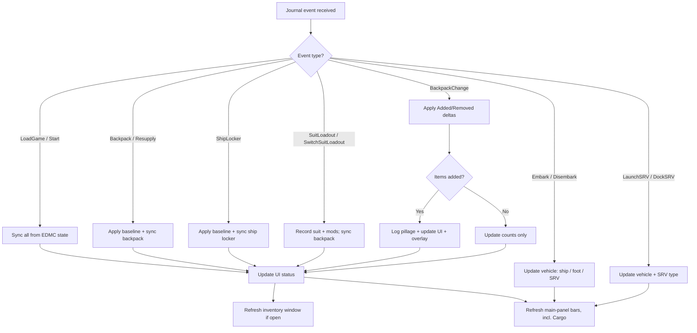

# ED-PLG Design Specification

**Version:** 1.1.0  
**Author:** CMDR Bocheaux  
**Last updated:** 2026-09-05

## 1. Purpose

ED-PLG (Elite Dangerous Pillage Ledger & Gear-tracker) is a lightweight
[Elite Dangerous Market Connector](https://github.com/EDCD/EDMarketConnector)
plugin for *Elite Dangerous: Odyssey* commanders who raid settlements, loot
containers, and download data while on foot.

The plugin answers two questions:

> *What did I just pick up, and how much of it do I now hold across my backpack,
> ship locker, and carrier locker?*

> *Do I have room — and enough already — to make this next pickup worth the slot?*

The first is answered passively, at the moment of looting (log line, EDMC panel,
and in-game overlay). The second is answered on demand, in the inventory window.

## 2. Scope

### In scope

- Odyssey microresources used for **suit and weapon upgrades**:
  - **Components** (e.g. Weapon Component, Carbon Fibre Plating) — *Assets* in-game
  - **Items** (e.g. Suit Schematic, Weapon Schematic) — *Goods* in-game
  - **Data** (e.g. Manufacturing Instructions, Settlement Plans)
- Inventory held in the **suit backpack** (on-foot), **ship locker** (stored), and
  **fleet carrier locker** (via CAPI).
- Backpack **capacity** for the currently worn suit.
- Real-time feedback via EDMC log output, a UI panel, and an optional in-game overlay.
- **Ship and SRV cargo-hold tonnage** (used vs. capacity only — see `cargo.py`),
  shown as a fourth main-panel bar that switches between the ship's cargo hold
  and the currently-deployed SRV's, so a commander doing salvage or mining runs
  can see hold pressure without leaving the panel. Deliberately narrow: this is
  a tonnage gauge, not commodity tracking — see Out of scope below.

### Out of scope

- Ship engineering materials (`Materials` event: Raw, Manufactured, Encoded).
- **Commodity identity, prices, and market data.** ED-PLG tracks cargo-hold
  *tonnage* (see In scope above) but has no idea what's actually in the hold,
  what it's worth, or where to sell it — that remains a separate game system
  this plugin does not model.
- Combat logging, bounty tracking, or market/trading data.
- Network services, cloud sync, or external databases.
- Consumables (tracked internally for completeness but not emphasised in output).

## 3. User Experience

### 3.1 Primary interaction

When the commander loots while on foot, the game writes a `BackpackChange`
journal event. ED-PLG detects additions and emits:

```
[Manufacturing Instructions] pillaged! New Inventory Total: 12
```

The total **X** reflects combined counts in the suit backpack and ship locker
for that resource.

This message's wording is configurable from **File → Settings → ED-PLG** as a
template with `{item}` and `{total}` placeholders (default
`"[{item}] pillaged! New Inventory Total: {total}"`); a blank or malformed
template falls back to the default rather than erroring (`ui.py`'s
`format_pillage_message`). It governs the log line, panel "last event" label,
and the return value passed to EDMC — not the terser overlay line (§3.4),
which stays fixed so it keeps fitting the overlay's stack.

### 3.2 UI panel

A header row on the EDMC main window is always visible and doubles as a
collapse toggle (state persisted in EDMC's config, same click-to-collapse
treatment as other panels in this developer's plugin lineup):

| Element | Content |
|---------|---------|
| Title | `▾ Pillage Ledger & Gear-tracker (ED-PLG):` (arrow flips to `▸` when collapsed) — click anywhere on the row to toggle. Spelled-out-name-plus-abbreviation, matching the title-line convention used across this developer's other EDMC plugins (e.g. EDMMM's "My Mission Manager (EDMMM)"). |
| Status | Current sync state (e.g. "Inventory synced", "+2 item(s) pillaged") |

Everything below the header collapses/expands together:

| Element | Content |
|---------|---------|
| Inventory bars | One row each for Backpack and Ship Locker (always shown), Carrier Locker (only once a fleet carrier is confirmed for this commander), and Cargo (when a vehicle applies — §12). Each shows a fixed-width label, a fixed-width bar drawn on a plain `tk.Canvas` (red once full), and a `used/capacity` (or bare count where capacity is unknown) reading. Clicking anywhere on a row opens the inventory window (§3.5) — there is no separate button. |
| Last event | Most recent pillage message (green text) |

The Carrier Locker row is gated on `InventoryTracker.fleet_carrier_callsign`
being set — which only happens from real Frontier CAPI locker data (see
Technical Specification §5.5) — rather than shown unconditionally at 0: a
commander with no fleet carrier at all
never triggers the `CarrierBuy`/`CarrierStats` events that fetch that data in
the first place, so "no callsign yet" reliably means "no confirmed carrier"
for that case, at the acceptable cost of the row also staying hidden for a
few minutes after a genuine carrier owner's session starts, until the first
CAPI fetch lands.

The UI updates only from the main EDMC thread via `journal_entry()` callbacks.
No background threads touch Tkinter widgets. Bar/label widths are fixed
regardless of content length or magnitude, so a long label or a large count
can never widen EDMC's main window — see this developer's standing rule for
`plugin_app` widgets in variable-content EDMC plugins generally.

Bars are drawn on a plain `tk.Canvas` (background + fill rectangles) rather
than a `ttk.Progressbar`: a ttk widget's native theme chrome doesn't reliably
follow EDMC's `theme.update()` walk the way plain tk widgets do, which
produced a visibly broken (oversized, unthemed white) bar in practice. A
Canvas's own explicit background plus rectangles that fully cover it look
correct under any theme regardless of that gap — the same approach this
developer's other plugins (e.g. EDMMM) already use for their own bars.

### 3.3 Log output

All pillage events are written at `INFO` level through Python's `logging` module.
Logs appear in `%TEMP%\EDMarketConnector.log` alongside core EDMC output.

### 3.4 In-game overlay

When an overlay plugin is present, each pickup is also drawn in-game:

```
+1  Manufacturing Instructions: 13
+2  Circuit Board: 5
```

| Property | Behaviour |
|----------|-----------|
| Provider | EDMCModernOverlay, via its legacy `edmcoverlay` compatibility layer |
| Absent provider | Silently skipped; the plugin is fully functional without it |
| Stack depth | 5 lines, newest first |
| Lifetime | 8 seconds per line |
| Repeat pickups | Update the item's existing line and float it to the top |
| Message IDs | `edplg-pillage-N`, sharing the `edplg-` prefix so the stack can be repositioned as a group from ModernOverlay's controller |
| Colour | Per category — Assets/Goods/Data each get a distinct colour (see below), rather than one flat colour for every pickup |
| Position | X/Y origin on the legacy overlay's 1280x960 virtual screen; editable in **File → Settings → ED-PLG** (default 900, 120) |
| User control | Toggle in **File → Settings → ED-PLG** |

The overlay is a *notification*, not a display: it answers "what did I just get",
and disappears. Standing information belongs in the inventory window — except
for the capacity panel below, which is deliberately a small standing exception
to that rule.

#### Category colour

Each pillage line's colour is set by the picked-up resource's category —
Component (Assets), Item (Goods), or Data — instead of one flat amber, so a
fast loot run is scannable by category at a glance without reading every
line (`overlay.CATEGORY_COLOURS`). The ship locker capacity warning (§8)
keeps its own distinct red regardless of category, since urgency there
matters more than category identity.

#### Ship locker capacity panel

An optional persistent panel drawn below the pillage stack — one row per
category (Assets/Goods/Data), each a label, a track-and-fill bar, and a
"total/capacity" value, all in that category's colour. Off by default
(**"Show ship locker capacity bars on the overlay"** in Settings); when on,
it redraws on every `ShipLocker` sync (and once at session start) so it
reflects the current ship locker without needing the inventory window open.

Unlike pillage lines, rows use a long TTL rather than a short fade — the
panel is meant to look persistent between updates, not disappear between
transfers. It uses EDMCModernOverlay's shape primitives (`send_shape`, via
the same legacy-compatible client), not just text — see
`docs/tech-spec.md` §6.3 for the exact payload shape. Backpack capacity
bars were considered but left out of this pass: ship locker capacity is
always known (flat 1000/category), while backpack capacity can be unknown
per suit (§7), which would need extra handling this pass didn't need.

#### ModernOverlay panel group (experimental)

When the connected provider identifies itself as EDMCModernOverlay (as
opposed to the original EDMCOverlay — see `edmcoverlay.MODERN_OVERLAY_IDENTITY`
in the tech spec), ED-PLG makes a best-effort attempt to register itself as
a ModernOverlay *plugin group*: a background panel behind the pillage stack
and capacity bars, anchored to a screen corner/edge (**"Overlay panel
anchor"** in Settings — nw/n/ne/w/center/e/sw/s/se) rather than positioned
purely by raw pixel X/Y. This uses an internal ModernOverlay API
(`overlay_plugin.overlay_api.define_plugin_group`) that sits outside the
documented-by-example legacy `edmcoverlay` surface the rest of this plugin
targets, and has not been validated against a live ModernOverlay install as
of this writing. Any failure — import error, signature mismatch, legacy
EDMCOverlay — is swallowed and ED-PLG simply falls back to plain positioned
elements exactly as before, so this is safe to attempt but not guaranteed
to look any different than the raw-X/Y behaviour until confirmed working
in-game.

### 3.4.1 Notification sound

An optional "Play a sound on pickup" checkbox (`sound.py`, off by default)
plays a short system sound once per `BackpackChange` event that produced at
least one announced pillage message. It uses the stdlib-only `winsound`
module, so it is Windows-only — the same "stays optional / no pip
dependency" shape as the overlay: unavailable on other platforms, the
checkbox is simply disabled there rather than erroring.

### 3.4.2 Announce-category preference

The Settings tab also lists a checkbox per tracked category (Assets, Goods,
Data) controlling whether that category's pickups produce a pillage
notification — log line, overlay line, and main-panel status. Unchecking a
category never stops it being tracked or counted (inventory totals and the
window are unaffected); it only silences the "you just picked this up"
notification path for that category. Ship locker capacity warnings (§8) are
gated by the same preference, per category.

### 3.5 Inventory window

Opened by clicking any bar on the main panel (§3.2); a non-modal `Toplevel`
that can stay open during play and refreshes live on every inventory-changing
journal event.

One tab per storage location — **Backpack**, **Ship Locker**, **Carrier Locker** —
each showing:

1. A heading naming the worn suit and its Extra Backpack Capacity status.
2. A total and capacity bar per category (Assets, Goods, Data).
3. Every resource held, with its count, sorted by category then descending count.

A single **Filter** box above the tabs narrows the item listing (all three
tabs) to resources whose display name contains the typed text
(case-insensitive); category totals and capacity bars are unaffected by it,
since those describe the whole store, not the filtered view.

This is the "should I loot this?" view: the capacity bar shows how close the
backpack is to full, and the item list shows how much of a resource is already
banked elsewhere. A category's bar and total turn amber at 90% of capacity — the
same threshold that triggers the ship locker overlay warning (§8) — and red once
at or over capacity, clearing back to normal as the count drops back under
threshold, so a commander glancing at the window sees the same "getting full"
signal the overlay would otherwise interrupt them with.

Where a capacity is unknown (see §7), the total is shown without a limit rather
than against a guessed figure, and never highlighted.

Window geometry is persisted between sessions in EDMC's config.

## 4. Functional Requirements

| ID | Requirement |
|----|-------------|
| FR-01 | Establish inventory baseline on game load (`LoadGame`, `Start`). |
| FR-02 | Refresh backpack baseline on `Backpack`, `Resupply`, and `SuitLoadout`. |
| FR-03 | Refresh ship locker baseline on `ShipLocker`. |
| FR-04 | Process `BackpackChange` `Added` entries and log pillage messages. |
| FR-05 | Process `BackpackChange` `Removed` entries silently (update counts only). |
| FR-06 | Map internal journal IDs to human-readable names. |
| FR-07 | Prefer `Name_Localised` from journal events when available. |
| FR-08 | Do not block the EDMC main thread during event handling. |
| FR-09 | Track the worn suit (`SuitLoadout`, `SwitchSuitLoadout`) and derive backpack capacity from it. |
| FR-10 | Send an overlay notification per pickup when an overlay provider is installed, and degrade silently when it is not. |
| FR-11 | Present backpack, ship locker, and carrier locker contents on demand, with per-category totals against capacity. |
| FR-12 | Never display a guessed capacity; show a bare count when the figure is unknown. |
| FR-13 | Warn (log + overlay) when a ship locker category crosses 90% of capacity, independently per category. |
| FR-14 | Highlight a category's capacity bar and total in the inventory window (amber at 90%, red at/over capacity) whenever its capacity is known. |

## 5. Data Model

Inventory is organised as three stores, each with three categories:

```
InventoryTracker
├── backpack
│   ├── Component  → { canonical_name: count, ... }
│   ├── Item       → { canonical_name: count, ... }
│   └── Data       → { canonical_name: count, ... }
├── ship_locker
│   ├── Component
│   ├── Item
│   └── Data
└── fleet_carrier_locker      (per-commander, cached; sourced from CAPI)
    ├── Component
    ├── Item
    └── Data

SuitState
├── suit_key   → explorationsuit | tacticalsuit | utilitysuit | flightsuit
├── grade      → 1-5
└── mods       → ("suit_backpackcapacity", ...)
```

Internal names are canonicalised (lowercase, no spaces) to match EDMC's
`monitor.canonicalise()` behaviour.

Carrier locker data is cached per commander so that switching accounts does not
bleed counts between CMDRs.

## 6. Event Flow



## 7. Suit Backpack Capacity

**The journal does not report backpack capacity.** It reports what is *in* the
backpack, never how much the backpack holds. Capacity must therefore be supplied
by the plugin.

It is derived from two journal fields on `SuitLoadout` / `SwitchSuitLoadout`:

| Field | Example | Use |
|-------|---------|-----|
| `SuitName` | `explorationsuit_class3` | Suit type (and grade, which does not affect capacity) |
| `SuitMods` | `["suit_backpackcapacity"]` | Presence of *Extra Backpack Capacity* |

These feed a hardcoded table in `suit.py` (see
[Technical Specification §7](./tech-spec.md#7-suit-backpack-capacity) for the values).

Design rules:

- **The plugin never guesses.** A suit with no table entry (currently the
  Flight Suit) shows counts with no capacity, rather than a plausible-looking
  wrong number. A wrong capacity is worse than no capacity: the entire point
  of the window is deciding whether to loot, and a bad figure produces a bad
  decision. The one exception is an explicit value the commander types in
  themselves (see below) — that's ground truth the commander observed
  in-game, not a plugin-generated guess.
- **Store the observed value, not the modifier.** Base and modded capacities are
  listed explicitly rather than derived by doubling, because the multiplier is not
  uniform across categories.
- Capacity figures are game data, not journal data, and may drift when Frontier
  rebalances suits. They live in one table so they can be corrected in one place.

The hardcoded table only tracks whether *Extra Backpack Capacity* is fitted,
not its engineering grade — so it can't be exactly right for every commander,
and has no entry at all for the Flight Suit. To cover both cases, the
Settings tab lets a commander enter their own observed capacity per
category, tracked per owned suit loadout (keyed by the journal's
`LoadoutID`, auto-discovered as loadouts are worn — see `suit.py`'s
`known_loadouts_for`/`set_override`). A blank field falls back to the
hardcoded default, so a later correction to the table isn't silently masked
by a stale override left over from before.

## 8. Ship Locker Capacity Warning

The ship locker caps at 1000 per category (Assets/Goods/Data). Filling a
category while out looting can force a commander to drop items rather than
store them — either at their own ship, or via an Apex shuttle's remote
"Manage Items" access, which is not a separate storage pool but a proxy
into the same locker (and therefore the same `ShipLocker` journal event
this plugin already tracks — no separate handling is needed for it).

Design rules:

- Warn at 90% of capacity per category (900/1000), independently per
  category.
- A category warns once per crossing: it does not repeat on every
  subsequent sync while still over threshold, but rearms once it drops
  back under 90% (e.g. after offloading) and later crosses again.
- Surfaced via the in-game overlay (distinct colour/TTL from pillage
  notifications, so it reads as a different class of message) and logged,
  so it's visible even without an overlay provider installed — consistent
  with FR-10's silent degradation.

## 9. Name Resolution Strategy

Display names are resolved in priority order:

1. `Name_Localised` from the journal event (authoritative in-game label).
2. Hand-curated overrides in `names.py` (`DISPLAY_NAMES` dict).
3. Generated table imported from FDevIDs (`names_fdevids.py`,
   `FDEVIDS_DISPLAY_NAMES` — see below).
4. Name learned from `Name_Localised` on an earlier event this session (`names.remember`).
5. Fallback: title-cased internal ID with underscores replaced by spaces.

Step 4 exists because the inventory window lists **everything** held, not just what
was looted this session, and even the generated table can lag brand-new content.
`Backpack`, `ShipLocker`, `BackpackChange`, and CAPI carrier payloads all carry the
game's own label for any resource whose display name differs from its internal ID,
so the game populates the cache as a side effect of normal syncing.

`DISPLAY_NAMES` therefore serves two narrow purposes: overriding the generated
table's label, and covering internal names ED-PLG has seen (or expects) in-game that
FDevIDs' `microresources.csv` doesn't yet list under that exact symbol. It is not
expected to enumerate every resource — that is the generated table's job.

### 9.1 Generated table (FDevIDs import)

`plugin/names_fdevids.py` is generated, not hand-written. `npm run update-names`
(`scripts/update-names.mjs`) fetches
[`EDCD/FDevIDs`'s `microresources.csv`](https://github.com/EDCD/FDevIDs/blob/master/microresources.csv)
— the community-maintained catalogue of Frontier's internal IDs also used by EDDN
and other EDCD tools — keeps only the `Component`/`Item`/`Data` rows (the
`Consumable` rows are out of scope, see §2), canonicalises each `symbol` the same
way `names.canonicalise()` does, and writes the result as a plain
`Dict[str, str]` module.

This is a deliberate maintenance step, not part of `npm run build`: the ordinary
build stays offline and reproducible, and only `update-names` touches the network.
A maintainer reruns it occasionally to pick up new Odyssey content, then commits
the regenerated file like any other source change — the running plugin never
fetches anything itself.

## 10. Non-Functional Requirements

| Attribute | Target |
|-----------|--------|
| Performance | Event handling completes in milliseconds; no I/O on hot path. |
| Reliability | Reconcile with EDMC `state` dict after each `BackpackChange`. |
| Compatibility | EDMC 5.x with Python 3.9+ (`plugin_start3` API). |
| Degradation | Optional dependencies (overlay) are absent-by-default: import failure disables the feature, never the plugin. |
| Maintainability | Modular layout: `load`, `inventory`, `cargo`, `suit`, `overlay`, `sound`, `window`, `names`, `names_fdevids` (generated), `ui`. |
| Portability | Pure Python plugin; build produces a copy-ready folder. |

## 11. Known Limitations

These are inherited from the game and EDMC, not bugs in ED-PLG:

- Backpack inventory may be incomplete if the commander logs in already on foot
  (no full baseline journal event in some cases). ED-PLG cannot fill this gap —
  EDMC only populates `state['BackPack']` from a fresh `Backpack`/`Resupply`
  event — but it tracks whether a real baseline has been seen this session
  (`InventoryTracker.backpack_baseline_seen`) and surfaces "backpack pending
  first sync" in the panel and inventory window rather than presenting a
  possibly-stale zero as a confirmed empty backpack.
- Grenade throws do not emit journal events; consumable counts may drift.
- EDMC's `BackPack` state is best-effort; ED-PLG reconciles against it after
  each change to stay aligned with core tracking.
- Backpack capacity is not journal-reported and is hardcoded per suit (§7); it can
  fall out of date if Frontier rebalances suits, and the *Extra Backpack Capacity*
  mod is only tracked as present/absent, not by engineering grade. The Flight
  Suit has no hardcoded entry at all. A commander can correct any of this
  per owned suit loadout from the Settings tab rather than editing `suit.py`.
- SRV cargo capacity is matched by a case-insensitive substring search against
  whatever the journal reports for `SRVType`/`SRVType_Localised` (the exact raw
  values aren't documented) — an unrecognised or new SRV type falls back to a
  generic label with capacity `None` rather than a wrong number.
- The Rhino SRV (added 2026-09-02) has a recognised display name but no
  capacity figure: Frontier describes its hold as expandable up to 24t with no
  confirmed journal field yet for the actual fitted amount. Its bar shows the
  current cargo count only, until that's confirmed against a real journal entry.

## 12. Ship & SRV Cargo

Added alongside the collapsible main panel (§3.2) as a deliberate, narrow
scope extension — see §2's In/Out of scope split for the boundary this stays
inside (tonnage only, never commodity identity or value).

`cargo.py`'s `VehicleState` tracks which of three vehicles the commander
currently occupies — `ship`, `foot`, or `srv` — purely from
Embark/Disembark/LaunchSRV/DockSRV journal events (see §6's Event Flow
diagram), since EDMC's own monitor state discards this distinction after
processing an event. It defaults to `ship` (the common case at `LoadGame`)
and is reset on every new commander session, so a stale vehicle from a
previous session can never bleed into a fresh one.

The main panel's fourth bar reads from `VehicleState.cargo_bar(state)`:

| Vehicle | Bar label | Capacity source |
|---------|-----------|------------------|
| Ship | "Ship Cargo" | `state['CargoCapacity']` (from EDMC's own `Loadout` handling) |
| SRV | `"<Type> Cargo"` | A small static table (`cargo.SRV_INFO`): Scarab 4t, Scorpion 2t; Rhino has a label but no confirmed capacity yet |
| On foot | *(bar hidden)* | N/A — no cargo hold applies |

Current cargo count, for either vehicle, is `sum(state['Cargo'].values())` —
the same field EDMC's monitor populates from `Cargo.json` regardless of which
hold is currently active, so no separate parsing is needed per vehicle.

## 13. Future Considerations

None currently — every enhancement previously listed here has shipped (see
`CHANGELOG.md`). New ideas belong in `TODO.md` until they're designed enough
to land here.

## 14. References

- [Technical Specification](./tech-spec.md)
- [Attributions & Credits](./ATTRIBUTIONS.md)
- [EDMC PLUGINS.md](https://github.com/EDCD/EDMarketConnector/blob/main/PLUGINS.md)
- [Odyssey Journal Events](https://elite-journal.readthedocs.io/en/latest/New%20in%20Odyssey.html)
